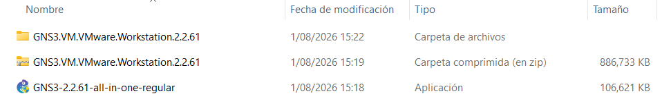
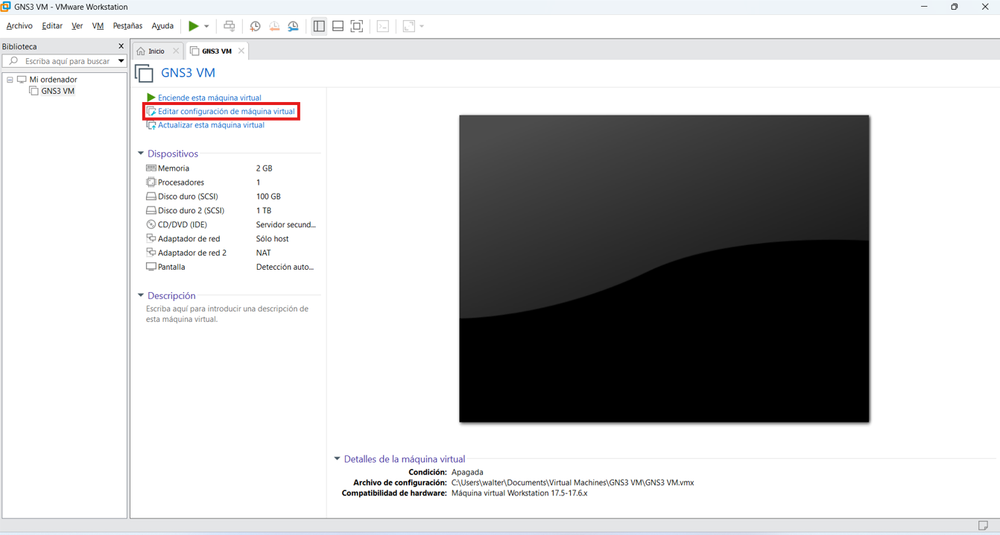
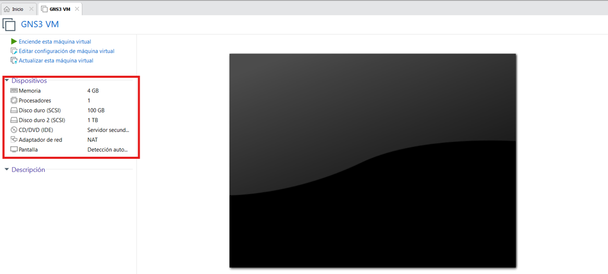
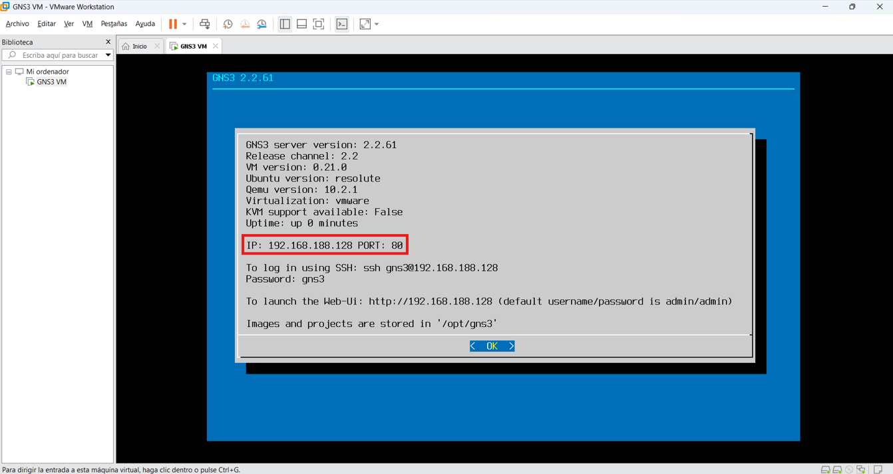
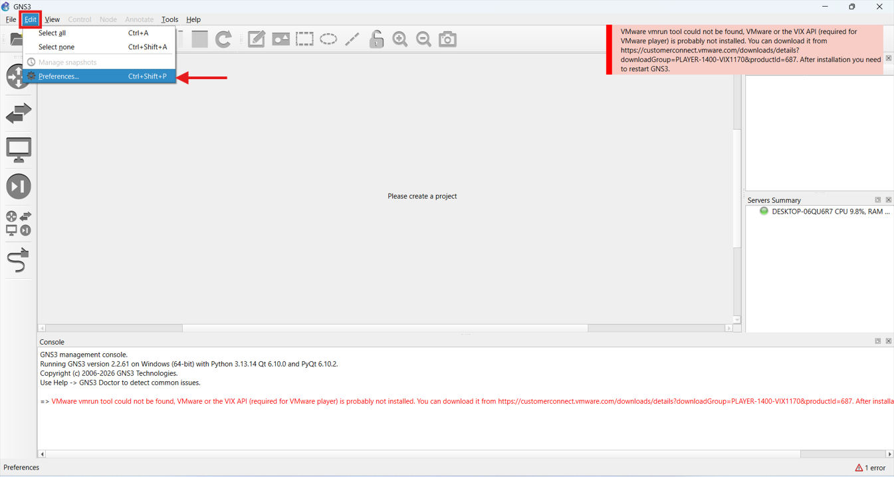
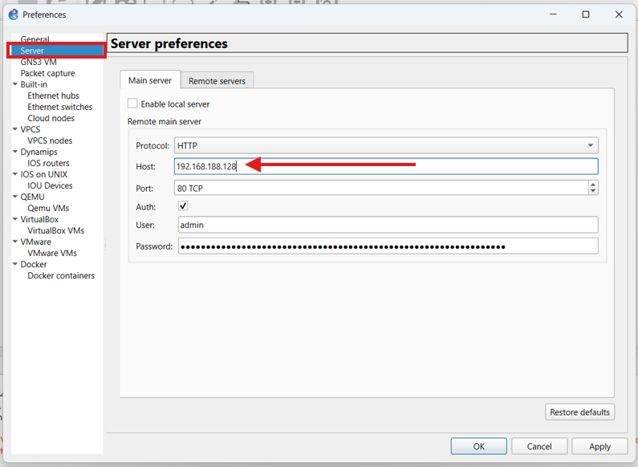
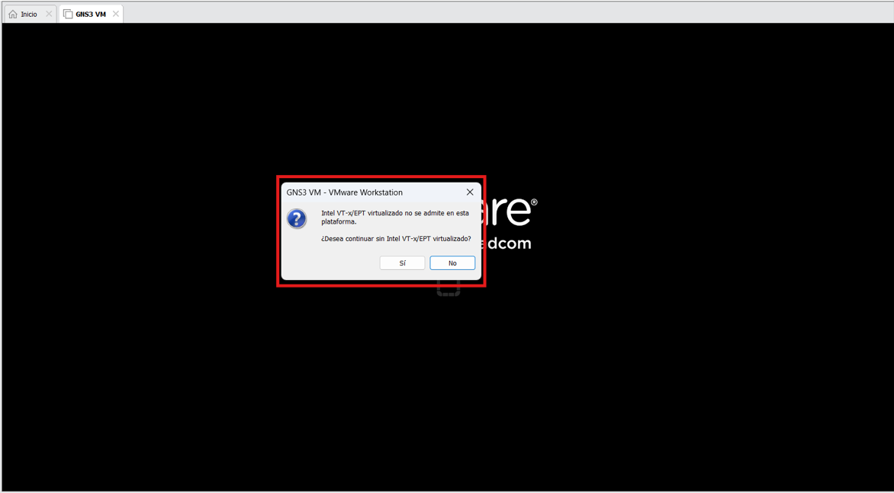
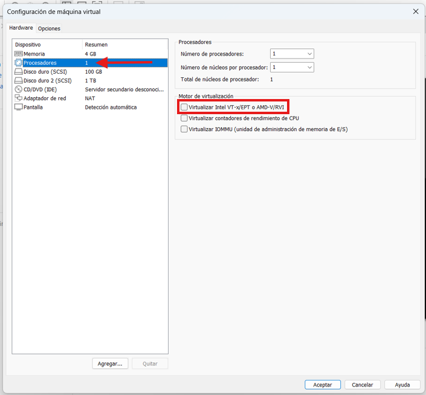

# Guía de Instalación GNS3

> [!TIP]
> Lee la guía completa antes de iniciar la instalación. Te ayudará a completar el proceso sin inconvenientes.

Una guía sencilla para instalar y comenzar a utilizar GNS3.

## Índice

1. Requisitos
2. Instalación de GNS3
3. Importar GNS3 VM
4. Inicio y configuración

## Requisitos

Antes de comenzar, verifica que cuentas con lo siguiente:

* Tener instalado VMware
* Instalador de GNS3
* Archivo de la GNS3 VM

Los archivos descargados deben verse de la siguiente manera:

  

> [!NOTE]
> Si aún no tienes VMware instalado consulta la siguiente guía.

## Instalación de GNS3

Ejecuta el instalador utilizando la configuración predeterminada. Solo presta atención a las siguientes ventanas:

| Ventana | Opción |
| -- | -- |
| **Choose Components** | Marcar las tres opciones |
| **GNS3 VM** | Marcar la opción de VMware Workstation |
| **License agreement** | Aceptar términos |
| **TraceNG** | Ingresar cualquier correo |
| **License Agreement and Privacy Notice** | Aceptar términos |
| **Solar-PuTTY** | Ingresar cualquier correo |
| **Solarwinds Engineer's Toolset** | Marcar *NO* y continuar |

Al finalizar la instalación, GNS3 se ejecutará automáticamente. Cierra todas sus ventanas, la configuración inicial se realizará después de iniciar la GNS3 VM.

## Importar GNS3 VM

* En VMware ir a `Archivo > Abrir...`
* Buscar la carpeta descomprimida y abrir el archivo que tenga de nombre `GNS3 VM`

> [!TIP]
> Dejar la ruta de almacenamiento por defecto.

Una vez importada la GNS3 VM se deben configurar los parámetros de la parte inferior.

  

> [!IMPORTANT]
> Realiza los cambios con la máquina virtual apagada.

| Configuración | Valor |
| -- | -- |
| Memoria | 3072-4096 MB |
| Procesadores | 1 |
| Núcleos | 1 |
| Virtualización | Activada: `Virtualizar Intel VT-x/EPT o AMD-V/RVI` |
| Adaptador de red | NAT |
| Adaptador de red 2 | Eliminar |

La configuración debería quedar así:

  

## Inicio y configuración

> [!IMPORTANT]
> Antes de abrir GNS3, inicia la GNS3 VM y espera a que termine de cargar. Este orden permite que GNS3 detecte automáticamente la GNS3 VM y evita errores de conexión durante la configuración inicial.

### Iniciar GNS3 VM

Al iniciar, debe aparecer una pantalla similar a la siguiente. La dirección IP será el único valor diferente.

  

### Configurar GNS3

Ejecuta GNS3 y accede a `Edit > Preferences`.

  

Configura las opciones como se muestra en la siguiente imagen. La única diferencia será la dirección IP, que debe coincidir con la mostrada en la GNS3 VM.

  

## Problemas frecuentes

A continuación se listarán algunos errores comunes o que se vayan reportando.

### Intel VT-x/EPT virtualizado no se admite en esta plataforma

  

Para solucionar esto, ingresa a las preferencias de la máquina y deshabilita la opción indicada en la imagen.

  

